# Estado actual de la UI

Este documento resume el estado vigente del prototipo y, sobre todo, los patrones compartidos que hoy deberían repetirse entre pantallas para evitar inconsistencias. No describe sólo qué existe, sino también cómo interactúan los componentes en desktop y mobile.

## Arquitectura actual por perfil

El shell superior permite cambiar entre roles habilitados para el usuario activo. El acceso a `Design System` no forma parte del flujo real de usuarios finales: hoy funciona como preview separada para el usuario de testing.

```mermaid
flowchart TB
    Selector[Selector de rol<br/>arriba a la derecha]
    Selector --> Importaciones
    Selector --> Direccion
    Selector --> Comercial
    Selector --> Tesoreria
    Selector --> Deposito
    Selector --> Despachante
    Selector --> Admin

    subgraph Importaciones[Importaciones]
        I0[Home del perfil]
        I0 --> I1[Carpetas OCs]
        I0 --> I2[Matriz de Arrivals]
        I0 --> I3[Panel de Notificaciones]
        I1 --> I1A[Listado de carpetas]
        I1 --> I1B[Nueva Carpeta]
        I1 --> I1C[Detalle de Carpeta]
        I1C --> I1C1[General]
        I1C --> I1C2[Artículos]
        I1C --> I1C3[Producción]
        I1C --> I1C4[Embarques]
        I1C --> I1C5[Anexos]
        I1C --> I1C6[Aduana SAP]
        I1C --> I1C7[Costeo]
        I2 --> I2A[KPIs de arrivals]
        I2 --> I2B[Filtros y búsqueda]
        I2 --> I2C[Tabla de cargas entrantes]
    end

    subgraph Direccion[Dirección]
        D0[Home del perfil]
        D0 --> D1[Control Gerencial]
        D0 --> D2[Auditoría Costos]
        D0 --> D3[Carpetas]
        D0 --> D4[Panel de Notificaciones]
        D1 --> D1A[KPIs ejecutivos]
        D1 --> D1B[Alertas críticas]
        D1 --> D1C[Acceso a detalle de carpeta]
        D2 --> D2A[Tabla de desvíos de coeficientes]
        D2 --> D2B[Acceso a detalle de carpeta]
        D3 --> D3A[Listado de carpetas]
        D3 --> D3B[Detalle de Carpeta solo lectura]
    end

    subgraph Comercial[Área Comercial]
        C0[Home del perfil]
        C0 --> C1[Carpetas]
        C0 --> C2[Matriz de Arrivals]
        C0 --> C3[Panel de Notificaciones]
        C1 --> C1A[Listado de carpetas sin importes]
        C1 --> C1B[Detalle de Carpeta solo lectura sin importes]
        C2 --> C2A[KPIs de arrivals]
        C2 --> C2B[Filtros y búsqueda]
        C2 --> C2C[Tabla de cargas entrantes]
    end

    subgraph Tesoreria[Tesorería]
        T0[Home del perfil]
        T0 --> T1[Flujo de Caja]
        T0 --> T2[Panel de Notificaciones]
        T1 --> T1A[Horizonte 7 15 30 días]
        T1 --> T1B[KPIs financieros]
        T1 --> T1C[Buscador]
        T1 --> T1D[Tabla de vencimientos y pagos]
    end

    subgraph Deposito[Depósito]
        W0[Home del perfil]
        W0 --> W1[Recepciones]
        W0 --> W2[Panel de Notificaciones]
        W1 --> W1A[Agenda de recepciones]
        W1 --> W1B[Check-in de recepción]
        W1B --> W1B1[Control de stock físico]
        W1B --> W1B2[Registro de incidencias]
    end

    subgraph Despachante[Despachante]
        P0[Home del perfil]
        P0 --> P1[Carpetas]
        P0 --> P2[Panel de Notificaciones]
        P1 --> P1A[Listado de carpetas]
        P1 --> P1B[Detalle operativo de embarques despacho]
        P1B --> P1B1[Canal aduana]
        P1B --> P1B2[Despacho ZFI ZFE]
        P1B --> P1B3[Gastos y VEP]
        P1B --> P1B4[Fechas de oficialización y salida]
    end

    subgraph Admin[Administrador General]
        A0[Home del perfil]
        A0 --> A1[Usuarios]
        A0 --> A2[Auditoría]
        A0 --> A3[Artículos]
        A0 --> A4[Proveedores]
        A0 --> A5[Panel de Notificaciones]
        A1 --> A1A[Listado de usuarios]
        A1 --> A1B[Alta edición baja]
        A2 --> A2A[Log de acciones]
        A2 --> A2B[Filtros por rol y búsqueda]
        A3 --> A3A[Catálogo de artículos]
        A4 --> A4A[Catálogo de proveedores]
    end

    subgraph DesignSystemPreview[Preview Design System]
        DS0[Acceso separado de testing]
        DS0 --> DS1[Tokens]
        DS0 --> DS2[Componentes]
        DS0 --> DS3[Patrones visuales]
    end
```

## Patrones compartidos vigentes

### Shell global

- `Header superior compartido`: barra blanca con borde inferior fino, logo a la izquierda y cluster de acciones a la derecha.
- `Menú de usuario desktop`: se abre como panel contenido al lado del trigger; muestra nombre, rol actual, cambio de perfil inline, settings y cerrar sesión.
- `Menú mobile`: no usa popups separados; despliega un panel propio bajo el header con secciones, perfil, cambio de rol y logout.
- `Cambio de perfil`: siempre debe percibirse como parte del bloque de perfil, no como un segundo modal ni como un dropdown externo.
- `Notificaciones`: se abren como panel lateral; en mobile ocupan el lateral completo disponible, en desktop flotan ancladas al botón.

### Navegación por perfil

- `Subnav por perfil`: usa una segunda barra de navegación contextual para las secciones del perfil activo.
- `Navegación a detalle`: cuando una entidad tiene continuidad operativa, la fila navega a una vista propia y la tabla principal queda compacta.
- `Preview Design System`: queda fuera del recorrido normal de Admin y no debe documentarse como permiso funcional del resto de usuarios.

### Acciones, búsquedas y densidad

- `Acción primaria fuera de la tabla`: altas como `Nuevo Usuario`, `Nuevo Artículo` o `Nuevo Proveedor` viven en una banda de acciones por fuera del shell tabular.
- `Búsqueda dentro del shell`: la primera línea del contenedor de tabla se reserva para búsqueda y filtros contextuales.
- `Acciones secundarias`: editar, eliminar o equivalentes quedan alineadas al extremo derecho de la fila o card.
- `Acción terciaria`: `Ver más` o `Ver menos` se usa como texto de baja jerarquía para desplegar detalle inline, separado de editar/eliminar.

### Tablas y listas

- `Tabla con navegación`: si la fila ya navega a una pantalla de detalle o tiene chevron/click de entrada, la lista principal no duplica información secundaria.
- `Tabla maestra sin detalle propio`: si la entidad no navega, la lista queda compacta y el resto del contenido se muestra con expandible inline.
- `Expandible inline`: hoy es el patrón vigente para Admin en Usuarios, Auditoría, Artículos y Proveedores.
- `Sticky lateral`: en desktop, la última columna puede quedar sticky para estado o acciones cuando mejora la lectura horizontal.
- `Jerarquía visual de fila`: nombre o identificador arriba; metadata esencial debajo; estado y acciones al borde derecho.

### Estados y feedback

- `Badges de estado`: pills de color tenue y semántica clara.
- `Alertas críticas`: usan tinte rojo o ámbar, no overlays innecesarios.
- `Modales`: se reservan para crear, editar, confirmar o acciones más pesadas; no para “leer más”.

## Interacción mobile vigente

### Regla general

- `No depender de scroll horizontal para entender o accionar`: si una tabla exige scroll para descubrir la acción principal, debe reconvertirse.
- `Resumen primero`: mobile muestra sólo el resumen operativo principal.
- `Detalle secundario`: se resuelve con navegación o expandible inline, según el tipo de entidad.

### Patrones mobile por tipo de lista

- `Listas operativas con continuidad`: pasan a cards compactas clickeables o filas resumidas. Esto aplica a Importaciones, Despachante, Recepciones y flujos similares.
- `Listas maestras`: pasan a cards densas con `Ver más` inline para exponer email, descripción, condiciones, detalle de auditoría o metadata secundaria.
- `Acciones`: en mobile se alinean abajo o a la derecha, pero separadas del `Ver más` para que no compitan visualmente.
- `Estado`: en mobile se prioriza en el encabezado de la card o en el extremo derecho de la primera línea.

### Comportamiento del shell en mobile

- `Header`: mantiene logo, campana y menú hamburguesa/perfil con targets grandes.
- `Perfil`: el cambio de rol queda dentro del mismo panel, expandido inline.
- `Secciones`: el acceso a las secciones del perfil se resuelve dentro del panel mobile compartido, no en overlays independientes.

## Inconsistencias pendientes a normalizar

### Superficies y contraste

- `Botones sobre tramas o fondos complejos`: todavía hay acciones que quedan transparentes o con contraste insuficiente en mobile.
- `Cards con elementos decorativos rotos`: en algunos módulos aparecen círculos de fondo demasiado grandes, que se leen como chips o badges mal renderizados.
- `Bloques críticos con fondo incorrecto`: alertas o componentes prioritarios siguen apareciendo con fondo transparente cuando deberían tener superficie propia.

### Navegación y jerarquía visual

- `Tabs que parecen botones`: en algunos detalles mobile la sección activa no se percibe como navegación persistente sino como CTA.
- `Jerarquía interna inconsistente`: dentro de tabs y cards todavía se mezclan resumen, edición, estados y acciones sin una prioridad visual estable.
- `Acciones primarias fuera de eje`: hay pantallas donde `Exportar`, `Nuevo artículo` u otras acciones no dejan claro a qué bloque pertenecen.

### Tablas, cards y responsive

- `Tablas aún desktop-first`: varias grillas siguen dependiendo de scroll horizontal para leer o accionar.
- `Cards demasiado altas o densas`: en mobile algunos resúmenes crecen de más y pierden separación entre ítems.
- `Acciones ocultas o difíciles de ejecutar`: hay vistas mobile donde no se puede completar la acción principal sin entrar en fricción.
- `Gráficos y componentes anchos`: algunos bloques obligan a scrollear sólo para ver contenido, sin adaptar la composición a mobile.

### Estados, chips e iconografía

- `Chips con criterios distintos`: estados, labels y badges todavía no comparten el mismo lenguaje visual entre pantallas.
- `Semántica de color incompleta`: faltan diferencias más claras entre vencido, próximo a vencer y estados neutros.
- `Iconografía inconsistente`: en algunos casos todavía se usan emojis en lugar de iconos del sistema.
- `Estados de solo lectura o cierre poco claros`: ciertos chips no comunican con suficiente claridad la restricción o condición del contenido.

### Edición, feedback y acciones

- `Edición inline vs edición en detalle`: todavía no está completamente consolidado en qué casos se edita en la tabla y en cuáles se entra a una pantalla propia.
- `Acciones equivalentes con estilos distintos`: confirmar, reportar, editar o cargar siguen variando demasiado según el módulo.
- `Falta de feedback post-acción`: algunas acciones mobile cambian el estado, pero no muestran snackbar ni opción de deshacer.
- `Cabeceras de paneles inconsistentes`: notificaciones y otros bloques superiores todavía no repiten exactamente la misma estructura entre preview y panel abierto.

## Patrón común objetivo para corregirlas

- `Una sola semántica por nivel de acción`: primario para avanzar o crear, secundario para soporte operativo, terciario textual para expandir o revelar detalle.
- `Tabs como navegación, no como botones`: la sección activa debe resolverse con subrayado, contraste o indicador persistente, no con apariencia de CTA.
- `Resumen visible sin scroll horizontal`: toda lista mobile debe dejar a la vista entidad, estado y acción principal en el primer pliegue.
- `Detalle secundario por inline expand o detalle dedicado`: si la entidad no tiene continuidad operativa, usar `Ver más`; si la tiene, entrar a detalle.
- `Misma gramática para chips y badges`: mismo tratamiento para estados, solo lectura, vencimientos, alertas y canales; cambia la semántica, no el componente base.
- `Color con significado estable`: rojo para vencido o crítico, ámbar para próximo evento o atención, verde para confirmado o correcto, neutro para dato informativo.
- `Iconografía de sistema`: reemplazar emojis y recursos improvisados por iconos consistentes con el resto del shell.
- `Cards mobile compactas`: sin ornamentos que invadan el contenido, con separación clara entre ítems y acciones siempre accesibles.
- `Feedback inmediato`: toda acción que altera estado debe poder confirmar el cambio y, cuando tenga sentido, ofrecer reversión.
- `Cabeceras repetibles`: campana, título, contador y acciones deben mantener el mismo orden y la misma relación jerárquica en cualquier panel equivalente.

## Componentes y descripción visual

### Navegación global

- `Header superior`: barra blanca con borde inferior gris muy fino, logo a la izquierda, trigger de usuario/perfil a la derecha y campana de notificaciones con contador rojo.
- `Selector de rol`: hoy vive dentro del bloque de perfil y se expande inline dentro del mismo panel.
- `Subnav por perfil`: segunda barra sobre fondo gris claro con navegación contextual por sección.

### Contenedores y estructura

- `Cards`: contenedores blancos con borde gris fino, radios amplios y padding generoso; se usan para bloques de datos, formularios, tablas y resúmenes.
- `Grillas de contenido`: composición en dos columnas para detalle y cards; layout centrado con ancho máximo grande y mucho aire en márgenes.
- `Listados`: filas limpias, tipografía sobria, separadores suaves y estados visuales a través de color, pills o borde lateral.

### Datos y estado

- `KPIs`: tarjetas horizontales con borde fino y una barra lateral de color; número principal grande y label secundaria pequeña debajo.
- `Badges de estado`: pills con fondo apenas teñido, color semántico y texto breve; algunos incluyen punto de color al inicio.
- `Canal aduana`: badge redondeado similar al de estado, con punto indicador y variantes Verde, Rojo y Pendiente.
- `Breadcrumb o contexto`: texto secundario en el extremo derecho de la subnav o debajo del título para indicar carpeta activa o último hito.

### Tablas y filas operativas

- `Tablas`: encabezado con fondo gris claro, texto en mayúscula pequeña, cuerpo blanco y líneas divisorias finas; en desktop pueden convivir con sticky lateral.
- `Cards mobile`: cuando una tabla pierde claridad en chico, se reconvierte a cards compactas con resumen y acción principal visible.
- `Filas de embarques`: en detalle de carpeta y flujos afines pueden resolverse como cards o filas operativas con borde lateral semántico.
- `Filas clickeables`: en dashboards y agendas cambian sutilmente de fondo al hover y llevan la atención al detalle de la entidad.
- `Filas expandibles`: en tablas maestras el detalle secundario aparece dentro de la misma fila o card mediante `Ver más`.

### Inputs y acciones

- `Buscadores`: inputs tipo pill sobre fondo gris claro, placeholder suave y sin peso visual excesivo.
- `Botón primario`: pill verde con texto blanco, usado para crear, guardar o exportar acciones principales.
- `Botón secundario`: fondo blanco o transparente, borde gris fino, radios completos y texto sobrio.
- `Botón terciario textual`: acción de apoyo como `Ver más` o `Ver menos`, sin competir con edición o borrado.
- `Tabs internas`: en detalle de carpeta son tabs horizontales con subrayado verde activo, no chips.

### Feedback y overlays

- `Panel de notificaciones`: drawer lateral derecho, fondo blanco, overlay translúcido y filas con color según tipo de alerta; ya ajustado para no romperse en anchos chicos.
- `Modales`: fondo oscurecido con blur, caja blanca centrada, radios amplios y acciones alineadas al pie; se usan para editar o confirmar, no para detalle de lectura.
- `Alertas e incidencias`: mensajes con tinte rojo, ámbar o verde según criticidad, usualmente apoyados por borde lateral o badge.

### Patrones por perfil

- `Importaciones`: patrón de referencia para densidad compacta; lista resumida con acceso claro al detalle, KPIs y acciones primarias fuera del shell tabular.
- `Dirección`: foco en KPIs ejecutivos, alertas críticas y vistas de auditoría con lectura rápida.
- `Área Comercial`: reutiliza estructura de carpetas y arrivals, pero con ocultamiento de importes.
- `Tesorería`: prioriza horizonte temporal, KPIs financieros y lista compacta de pagos con acción operativa visible.
- `Depósito`: usa agenda/listado y flujo de check-in con control físico e incidencias.
- `Despachante`: estructura de carpetas con detalle operativo centrado en aduana, despacho, gastos y fechas; en mobile hoy usa cards compactas.
- `Administrador General`: listas maestras compactas con expandible inline para detalle secundario en Usuarios, Auditoría, Artículos y Proveedores.
- `Design System preview`: vista separada de testing; no debe tratarse como permiso ni módulo estándar del perfil Admin.