# Documentación separada

## Índice de trabajo

- [01_ESTADO_ACTUAL_UI.md](c:\Users\Ashley_Brenner\Documents\Dimagraf-13-7\01_ESTADO_ACTUAL_UI.md): estado actual del prototipo, pantallas existentes, arquitectura visual y navegación actual.
- [02_ROLES_Y_FLUJOS.md](c:\Users\Ashley_Brenner\Documents\Dimagraf-13-7\02_ROLES_Y_FLUJOS.md): qué hace cada rol, por dónde ingresa, qué debe lograr y cuál es su flujo principal.
- [03_MODULOS_Y_COBERTURA.md](c:\Users\Ashley_Brenner\Documents\Dimagraf-13-7\03_MODULOS_Y_COBERTURA.md): qué se necesita resolver en cada parte del negocio y qué tan cubierto está hoy.
- [04_FALTANTES_Y_BACKLOG.md](c:\Users\Ashley_Brenner\Documents\Dimagraf-13-7\04_FALTANTES_Y_BACKLOG.md): faltantes, ajustes, backlog y relación con áreas funcionales.

## Nota

El contenido que sigue se mantiene como documento maestro previo. Los nuevos archivos están pensados para trabajarse por separado y evitar que toda la información quede resumida en un único archivo.

# Arquitectura de la información por perfil

El selector ubicado arriba a la derecha permite cambiar el rol o perfil activo dentro del prototipo.

## 1. Estado actual

Esta sección muestra cómo está resuelto hoy el prototipo. La idea es entender qué pantallas existen actualmente, cómo se ven y qué parte del proceso parecen cubrir, sin asumir que quien lee ya conoce el negocio de importaciones.

```mermaid
flowchart TB
	Selector[Selector de rol<br/>arriba a la derecha]
	Selector --> Importaciones
	Selector --> Direccion
	Selector --> Comercial
	Selector --> Tesoreria
	Selector --> Deposito
	Selector --> Despachante
	Selector --> Admin

	subgraph Importaciones[Importaciones]
		I0[Home del perfil]
		I0 --> I1[Carpetas OCs]
		I0 --> I2[Matriz de Arrivals]
		I0 --> I3[Panel de Notificaciones]
		I1 --> I1A[Listado de carpetas]
		I1 --> I1B[Nueva Carpeta]
		I1 --> I1C[Detalle de Carpeta]
		I1C --> I1C1[General]
		I1C --> I1C2[Artículos]
		I1C --> I1C3[Producción]
		I1C --> I1C4[Embarques]
		I1C --> I1C5[Anexos]
		I1C --> I1C6[Aduana SAP]
		I1C --> I1C7[Costeo]
		I2 --> I2A[KPIs de arrivals]
		I2 --> I2B[Filtros y búsqueda]
		I2 --> I2C[Tabla de cargas entrantes]
	end

	subgraph Direccion[Dirección]
		D0[Home del perfil]
		D0 --> D1[Control Gerencial]
		D0 --> D2[Auditoría Costos]
		D0 --> D3[Carpetas]
		D0 --> D4[Panel de Notificaciones]
		D1 --> D1A[KPIs ejecutivos]
		D1 --> D1B[Alertas críticas]
		D1 --> D1C[Acceso a detalle de carpeta]
		D2 --> D2A[Tabla de desvíos de coeficientes]
		D2 --> D2B[Acceso a detalle de carpeta]
		D3 --> D3A[Listado de carpetas]
		D3 --> D3B[Detalle de Carpeta solo lectura]
	end

	subgraph Comercial[Área Comercial]
		C0[Home del perfil]
		C0 --> C1[Carpetas]
		C0 --> C2[Matriz de Arrivals]
		C0 --> C3[Panel de Notificaciones]
		C1 --> C1A[Listado de carpetas sin importes]
		C1 --> C1B[Detalle de Carpeta solo lectura sin importes]
		C2 --> C2A[KPIs de arrivals]
		C2 --> C2B[Filtros y búsqueda]
		C2 --> C2C[Tabla de cargas entrantes]
	end

	subgraph Tesoreria[Tesorería]
		T0[Home del perfil]
		T0 --> T1[Flujo de Caja]
		T0 --> T2[Panel de Notificaciones]
		T1 --> T1A[Horizonte 7 15 30 días]
		T1 --> T1B[KPIs financieros]
		T1 --> T1C[Buscador]
		T1 --> T1D[Tabla de vencimientos y pagos]
	end

	subgraph Deposito[Depósito]
		W0[Home del perfil]
		W0 --> W1[Recepciones]
		W0 --> W2[Panel de Notificaciones]
		W1 --> W1A[Agenda de recepciones]
		W1 --> W1B[Check-in de recepción]
		W1B --> W1B1[Control de stock físico]
		W1B --> W1B2[Registro de incidencias]
	end

	subgraph Despachante[Despachante]
		P0[Home del perfil]
		P0 --> P1[Carpetas]
		P0 --> P2[Panel de Notificaciones]
		P1 --> P1A[Listado de carpetas]
		P1 --> P1B[Detalle operativo de embarques despacho]
		P1B --> P1B1[Canal aduana]
		P1B --> P1B2[Despacho ZFI ZFE]
		P1B --> P1B3[Gastos y VEP]
		P1B --> P1B4[Fechas de oficialización y salida]
	end

	subgraph Admin[Administrador General]
		A0[Home del perfil]
		A0 --> A1[Usuarios]
		A0 --> A2[Auditoría]
		A0 --> A3[Artículos]
		A0 --> A4[Proveedores]
		A0 --> A5[Design System]
		A0 --> A6[Panel de Notificaciones]
		A1 --> A1A[Listado de usuarios]
		A1 --> A1B[Alta edición baja]
		A2 --> A2A[Log de acciones]
		A2 --> A2B[Filtros por rol y búsqueda]
		A3 --> A3A[Catálogo de artículos]
		A4 --> A4A[Catálogo de proveedores]
		A5 --> A5A[Tokens]
		A5 --> A5B[Componentes]
		A5 --> A5C[Patrones visuales]
	end
```

### Componentes y descripción visual

### Navegación global

- `Header superior`: barra blanca con borde inferior gris muy fino, logo a la izquierda, trigger de usuario/perfil a la derecha y campana de notificaciones con contador rojo.
- `Selector de rol`: botón redondeado con iniciales y nombre corto del perfil activo; el menú desplegable mantiene el cambio de rol dentro de los permisos asignados al usuario.
- `Subnav por perfil`: segunda barra sobre fondo gris claro; en algunos casos usa pills activas verdes y en otros tabs lineales según la pantalla.

### Contenedores y estructura

- `Cards`: contenedores blancos con borde gris fino, radios amplios y padding generoso; se usan para bloques de datos, formularios, tablas y resúmenes.
- `Grillas de contenido`: composición en dos columnas para detalle y cards; layout centrado con ancho máximo grande y mucho aire en márgenes.
- `Listados`: filas limpias, tipografía sobria, separadores suaves y estados visuales a través de color, pills o borde lateral.

### Datos y estado

- `KPIs`: tarjetas horizontales con borde fino y una barra lateral de color; número principal grande y label secundaria pequeña debajo.
- `Badges de estado`: pills con fondo apenas teñido, color semántico y texto breve; algunos incluyen punto de color al inicio.
- `Canal aduana`: badge redondeado similar al de estado, con punto indicador y variantes Verde, Rojo y Pendiente.
- `Breadcrumb o contexto`: texto secundario en el extremo derecho de la subnav o debajo del título para indicar carpeta activa o último hito.

### Tablas y filas operativas

- `Tablas`: encabezado con fondo gris claro, texto en mayúscula pequeña, cuerpo blanco y líneas divisorias finas; se usan para arrivals, cashflow, artículos y auditoría.
- `Filas de embarques`: en detalle de carpeta no son tabla clásica, sino filas dentro de una card con fondo gris claro, borde izquierdo de color y badges embebidos.
- `Filas clickeables`: en dashboards y agendas cambian sutilmente de fondo al hover y llevan la atención al detalle de la entidad.

### Inputs y acciones

- `Buscadores`: inputs tipo pill sobre fondo gris claro, placeholder suave y sin peso visual excesivo.
- `Botón primario`: pill verde con texto blanco, usado para crear, guardar o exportar acciones principales.
- `Botón secundario`: fondo blanco o transparente, borde gris fino, radios completos y texto sobrio.
- `Tabs internas`: en detalle de carpeta son tabs horizontales con subrayado verde activo, no chips.

### Feedback y overlays

- `Panel de notificaciones`: drawer lateral derecho, fondo blanco, overlay translúcido y filas con color según tipo de alerta.
- `Modales`: fondo oscurecido con blur, caja blanca centrada, radios amplios y acciones alineadas al pie.
- `Alertas e incidencias`: mensajes con tinte rojo, ámbar o verde según criticidad, usualmente apoyados por borde lateral o badge.

### Patrones por perfil

- `Importaciones`: foco en tablas operativas, detalle por tabs, KPIs de pipeline y acciones de alta de carpeta.
- `Dirección`: foco en KPIs ejecutivos, alertas críticas y vistas de auditoría con lectura rápida.
- `Área Comercial`: reutiliza estructura de carpetas y arrivals, pero con ocultamiento de importes.
- `Tesorería`: prioriza filtros temporales, KPIs financieros y tabla de vencimientos.
- `Depósito`: usa agenda/listado y flujo de check-in con control físico e incidencias.
- `Despachante`: estructura de carpetas con detalle operativo centrado en aduana, despacho, gastos y fechas.
- `Administrador General`: pantallas tabulares y modales CRUD para usuarios, auditoría, artículos, proveedores y design system.

### Comparación con módulos funcionales

#### Lectura rápida

- `Bien cubierto`: MOD-003, MOD-006, parte de MOD-007, parte de MOD-008, parte de MOD-010, parte de MOD-011, parte de MOD-012.
- `Cobertura parcial`: MOD-001, MOD-002, MOD-005, MOD-009.
- `Cobertura baja o ausente`: MOD-004 y VAL como componente transversal visible en flujo.

#### Qué se busca lograr en cada módulo y cómo está cubierto hoy

- `Órdenes de Compra`:
	Acá se debería poder iniciar el proceso, crear la carpeta de importación, registrar la información comercial básica de la OC y mantenerla como punto de partida del resto del flujo. Hoy esto está cubierto de forma parcial en `Carpetas (OCs)` y `Nueva Carpeta`, pero faltan piezas importantes como contrato marco, validaciones previas, referencias operativas más completas y una administración más rica de la OC.

- `Artículos y saldos`:
	Acá se debería poder ver qué artículos componen cada OC, cuánto se compra, cuánto llegó, cuánto queda pendiente y cuándo una carpeta puede considerarse cerrada por saldo cero. Hoy existe una base en `Detalle de Carpeta > Artículos`; `~~el saldo básico por asignación a embarques y el cierre automático por saldo cero como faltantes iniciales~~` ya quedaron resueltos, pero todavía no alcanza para seguir equivalencias con la profundidad que pide el proceso real.

- `Embarques y subcarpetas`:
	Esta parte debería permitir dividir una carpeta madre en aperturas como `A`, `B` o `C`, seguir cada embarque por separado y también contemplar casos donde un mismo despacho mezcle más de una OC. Conceptualmente está bastante bien representado en `Detalle de Carpeta > Embarques` y en `Despachante`, aunque todavía no se ve bien el caso de embarques compuestos.

- `Producción y pre-embarque`:
	Acá se debería poder seguir qué prometió el proveedor, si ya confirmó el pedido, cómo avanza la producción, si hay demoras y cuándo una carga está lista para embarcar. Hoy casi no está representado en el prototipo: falta una pantalla clara para seguimiento, alertas y validaciones de esta etapa.

- `Documentación de importaciones`:
	Esta parte debería concentrar facturas, packing lists, conocimientos de embarque, certificados y otros anexos, dejando claro qué documento pertenece a cada OC o subembarque y quién puede verlo. Hoy aparece en `Detalle de Carpeta > Anexos / Documentos`, pero más como consulta simple que como un módulo documental completo.

- `Tránsito y arribos`:
	Acá se debería poder entender qué está viajando, cuándo llega, qué proveedor está involucrado y cómo evolucionan las fechas de arribo. Es una de las áreas mejor resueltas del prototipo actual, especialmente en `Matriz de Arrivals` y en los estados visibles dentro de `Carpetas`.

- `Nacionalización y despacho aduanero`:
	Esta parte debería permitir seguir qué pasa con cada embarque al llegar a aduana: quién es el despachante, qué canal tocó, qué gastos hay, qué VEP corresponde y qué fechas son críticas. La pantalla de `Despachante` cubre bastante de esto, aunque todavía faltan señales operativas del proceso real como OK despachante, OK cruce/carga, pedido de fondos y trazabilidad de intercambios informales.

- `Recepción en depósito`:
	Acá se debería poder avisar que llega un embarque, verificar físicamente artículos y cantidades, registrar incidencias y confirmar la recepción. `Recepciones` y `Check-in` resuelven bien la parte operativa, aunque todavía falta reflejar mejor lo que pasa después en SAP y en la administración del proceso.

- `Costeo y referencia SAP`:
	Esta parte debería conectar el seguimiento operativo con las referencias manuales de SAP, incluyendo Tx 45, Tx 55, Tx 18 y los coeficientes de costeo. Hoy hay indicios de esa lógica, pero todavía no está claramente expresado que el coeficiente pertenece a la apertura o subcarpeta, no a la carpeta madre.

- `Pagos y proyección financiera`:
	Acá se debería poder anticipar vencimientos, organizar pagos, distinguir lo estimado de lo real y dar visibilidad a Tesorería e Importaciones. `Flujo de Caja` ya muestra una base útil, pero todavía no cubre toda la complejidad financiera del proceso actual.

- `Reportes y consulta para áreas`:
	Esta capa debería resolver qué necesita ver cada área sin obligarla a entrar en el detalle operativo completo. El prototipo ya ofrece vistas útiles como `Matriz de Arrivals`, `Flujo de Caja`, `Control Gerencial` y `Auditoría Costos`, pero todavía falta representar mejor los reportes concretos que hoy se producen manualmente.

- `Seguridad, perfiles y auditoría`:
	Acá se debería poder definir quién entra, qué puede ver, qué puede editar y cómo queda trazado lo que hizo cada usuario. El prototipo ya deja ver perfiles, administración de usuarios y auditoría; `~~la base multirol como faltante estructural~~` ya quedó resuelta, aunque todavía falta la parte más avanzada de configuración documental y reglas por proveedor.

- `Validación automática contra OC`:
	Esta capacidad debería ayudar a comparar documentos del proveedor contra la OC cargada, detectar diferencias y pedir confirmación cuando algo no coincide. Hoy no aparece como experiencia visible dentro del prototipo, aunque si forma parte del alcance debería integrarse en los puntos de confirmación, pre-embarque y configuración por proveedor.

#### Impacto sobre la arquitectura actual

- La arquitectura actual está más cerca de una solución operativa de seguimiento de carpetas y embarques que de un mapa completo del proceso end-to-end.
- Para alinearse con este modelo modular, habría que reforzar especialmente `MOD-004`, `MOD-005`, `MOD-009`, `MOD-010` y la integración visible de `VAL`.
- `MOD-003`, `MOD-006`, `MOD-007` y `MOD-008` ya tienen una base visual útil sobre la que conviene evolucionar, no reemplazar.

## 2. Documentación por rol

Esta sección explica cada rol como si fuera la primera vez que alguien se acerca al proyecto. La idea es responder tres preguntas simples: por dónde entra cada usuario, qué debería poder resolver y qué resultado espera obtener al recorrer su flujo.

### Importaciones / Comex

- `Dónde ingresa`: entra por `Carpetas (OCs)`. También consulta `Matriz de Arrivals`, `Panel de Notificaciones` y debería acceder a calendario de vencimientos.
- `Qué debe lograr`: transformar una orden de compra en una carpeta trazable de punta a punta, con sus artículos, aperturas, documentos, hitos logísticos, referencias SAP y compromisos financieros.
- `Qué debe hacer`: abrir carpetas, cargar datos generales de la OC, mantener artículos y saldos, abrir subcarpetas/embarques, registrar documentación, hacer seguimiento de producción, coordinar despacho, avisar a depósito, cargar referencias SAP y monitorear pagos y vencimientos.
- `Flujo principal`:
	`Carpetas` -> `Nueva Carpeta` -> `Carga manual o masiva de artículos` -> `~~Revisión manual pesada dentro del modal~~` -> `Detalle de carpeta / Artículos` -> `Validación de confirmación proveedor` -> `Seguimiento de producción` -> `Apertura de embarque/subcarpeta` -> `Anexos / documentación` -> `Tránsito / Arrivals` -> `Aduana / SAP` -> `Recepción / aviso a depósito` -> `Costeo SAP` -> `Pagos` -> `Cierre de carpeta`.
- `Objetivo de negocio`: tener trazabilidad end-to-end de cada carpeta madre y de cada apertura, sin depender de Excel y correo como eje operativo.

### Comercial

- `Dónde ingresa`: por necesidad de negocio debería entrar a `Matriz de Arrivals` como vista principal. Hoy el prototipo entra a `Carpetas`.
- `Qué debe lograr`: saber qué artículos vienen en camino, cuándo podrían estar disponibles y qué cambios logísticos podrían impactar al equipo comercial.
- `Qué debe hacer`: consultar fechas de llegada por artículo, revisar tránsito, ver estado de carpetas relacionadas y anticipar disponibilidad comercial sin exponer importes sensibles.
- `Flujo principal`:
	`Matriz de Arrivals` -> `Filtros por artículo / línea / fecha` -> `Consulta de carpeta vinculada` -> `Detalle de carpeta en solo lectura sin importes`.
- `Objetivo de negocio`: planificar ventas y disponibilidad a partir de arribos confirmados y próximos eventos logísticos.

### Dirección

- `Dónde ingresa`: `Control Gerencial`.
- `Qué debe lograr`: tener una lectura ejecutiva del negocio de importaciones, identificando riesgos, desvíos de costo, alertas y próximos compromisos relevantes.
- `Qué debe hacer`: revisar KPIs ejecutivos, alertas críticas, desvíos de coeficientes, estado general de carpetas y próximos compromisos relevantes.
- `Flujo principal`:
	`Control Gerencial` -> `Alertas críticas` -> `Detalle de carpeta solo lectura` -> `Auditoría Costos` -> `Calendario / vencimientos clave`.
- `Objetivo de negocio`: supervisión ejecutiva, desvíos y toma de decisiones sin entrar al detalle operativo cotidiano.

### Tesorería

- `Dónde ingresa`: `Flujo de Caja`.
- `Qué debe lograr`: anticipar necesidades de fondos, entender qué pagos se acercan y registrar lo efectivamente pagado para no perder trazabilidad financiera.
- `Qué debe hacer`: ver vencimientos, compromisos por proveedor, VEP y flete, identificar criticidad, registrar pagos ejecutados y coordinar fondos.
- `Flujo principal`:
	`Flujo de Caja` -> `Calendario de vencimientos` -> `Detalle por carpeta/subcarpeta` -> `Registro de pago real` -> `Estado de pagos`.
- `Objetivo de negocio`: administrar previsión financiera y ejecución de pagos sobre información confiable y anticipada.

### Depósito

- `Dónde ingresa`: `Recepciones`.
- `Qué debe lograr`: validar que lo que llega físicamente coincide con lo esperado y dejar asentadas conformidades o diferencias de manera operativa.
- `Qué debe hacer`: recibir preaviso, controlar físicamente artículos, comparar cantidades teóricas vs reales, registrar incidencias y confirmar recepción.
- `Flujo principal`:
	`Recepciones` -> `Agenda de embarques entrantes` -> `Check-in de recepción` -> `Control físico` -> `Incidencias` -> `Conformidad de recepción`.
- `Objetivo de negocio`: asegurar ingreso físico correcto y dejar evidencia operativa de discrepancias y conformidades.

### Despachante

- `Dónde ingresa`: `Carpetas` del perfil despachante.
- `Qué debe lograr`: completar la información aduanera de cada apertura para que el resto del circuito tenga visibilidad clara del estado de nacionalización.
- `Qué debe hacer`: completar datos de nacionalización por apertura, informar canal, despacho, VEP, gastos y fechas críticas de oficialización y salida.
- `Flujo principal`:
	`Carpetas activas` -> `Detalle operativo por subcarpeta` -> `Canal` -> `Despacho ZFI/ZFE` -> `Gastos y VEP` -> `Fechas clave`.
- `Objetivo de negocio`: centralizar la información aduanera operativa en cada apertura/embarque.

### Administrador General

- `Dónde ingresa`: `Usuarios`.
- `Qué debe lograr`: asegurar que el sistema esté correctamente parametrizado, con accesos controlados, datos maestros consistentes y trazabilidad de acciones.
- `Qué debe hacer`: administrar usuarios, roles, permisos, auditoría, catálogos maestros y configuración extendida por proveedor para análisis documental. `~~Asignación multirol como faltante base~~` ya quedó resuelta en el ABM del prototipo.
- `Flujo principal`:
	`Usuarios` -> `Roles y permisos` -> `Auditoría` -> `Artículos` -> `Proveedores` -> `Configuración documental / VAL`.
- `Objetivo de negocio`: sostener seguridad, parametrización y gobernanza de la operación.

## 3. Qué hay que hacer

Esta sección ya no describe lo que existe hoy, sino lo que todavía falta para que la solución cubra mejor el proceso real. Está pensada como una lista de trabajo que ayude a convertir el prototipo actual en una herramienta más completa.

### Alta prioridad funcional

- ~~`Carga masiva de artículos por carpeta`: hoy la carga es manual de a un artículo. Falta importación masiva con `código de artículo`, `cantidad`, `UM`, `UME`, equivalencias y datos adicionales de la OC.~~
- `Validación automática documento vs OC`: falta función para comparar confirmación de pedido contra OC por descripción, ítems y cantidades, aceptando documentos en inglés, Excel o PDF, con confirmación de diferencias.
- `Validación automática factura vs confirmación`: misma lógica que el punto anterior, comparando factura con confirmación previamente validada.
- `Solapa Pagos en la carpeta`: hoy falta una instancia explícita en el flujo interno de la carpeta para vencimientos, pagos reales, banco, condición facturada, pago marítima y pago aduana.
- `Coeficiente por apertura y no por carpeta madre`: debe reflejarse en modelo y UI que el coeficiente pertenece a `437-A`, `437-B`, etc. La carpeta madre no tiene coeficiente salvo apertura propia.
- `Atributos editables por rol`: falta definir y aplicar qué campos puede editar cada perfil.

### Ajustes de navegación y perfiles

- `Perfil Comercial`: la vista principal debe ser `Matriz de Arrivals`, no `Carpetas`.
- ~~`Seguridad multirol`: permitir más de un rol por usuario, por ejemplo `Tesorería + Importaciones`.~~
- `Calendario de vencimientos`: agregar vista o widget para `Importaciones`, `Tesorería` y `Dirección`.

### Ajustes de grillas y listados

- `Vista de carpetas con expansión inline`: agregar `+/-` para desplegar artículos sin entrar al detalle.
- `Carpeta madre y aperturas en misma jerarquía visual`: en la grilla principal deben verse al mismo nivel entidades como `437` y `437-A`.
- `Grilla principal con más atributos`: incorporar columnas adicionales y evaluar una grilla dinámica configurable.
- `Grilla principal con mayores filtros`: ampliar filtros por estado, proveedor, línea, fecha, transporte, despachante, canal, etc.
- `Paginado en listas de artículos`: necesario para escalar y no depender de tablas completas en memoria.

### Ajustes específicos por pantalla

- `Matriz de Arrivals`: ordenar por fecha de llegada y también por descripción; agregar más filtros.
- `Depósito`: agregar `UME` y `UM` en recepción/check-in.
- `Terminología`: donde hoy diga `mercadería`, debería normalizarse a `artículo` cuando corresponda al modelo funcional.

### Documentación y anexos

- `Clasificación de archivos al subirlos`: cada anexo debería clasificarse por tipo documental y visibilidad por rol.
- `Anexos en una única solapa`: mantener todos los archivos en un mismo punto, pero con visualización condicionada por perfil.

### Alertas y reglas de negocio

- `Alertas para Comex`: próximos a embarcar, confirmaciones pendientes, próximos eventos, demoras de producción, arribos críticos y vencimientos.
- `Próximos eventos`: incorporar lógica temporal visible en dashboards y notificaciones, no solo estados estáticos.

### Ajustes de propuesta y escalabilidad

- `Capacidad operativa`: corregir la propuesta base considerando que pueden existir `20 embarques mensuales` pero `100 activos simultáneos`.
- `Escalabilidad de listas`: la solución debe pensar en volumen, filtros compuestos, paginado y vistas resumidas para no colapsar grillas.

### Traducción de faltantes a módulos

- `MOD-001`: ~~carga masiva de artículos asociada a carpeta~~ y enriquecimiento de atributos de OC.
- `MOD-002`: ~~saldos por artículo y cierre lógico de saldo cero como base operativa~~, despliegue inline en grilla y paginado.
- `MOD-003`: carpeta madre y aperturas al mismo nivel visual; soporte fuerte para embarques compuestos.
- `MOD-004`: alertas, seguimiento de producción, confirmaciones pendientes y próximos embarques.
- `MOD-005`: clasificación documental, visibilidad por rol y validación documental automática.
- `MOD-006`: arrivals con orden dinámico, mayores filtros y foco comercial como entrada principal.
- `MOD-007`: más atributos en grilla y detalle para despacho, canal y eventos aduaneros.
- `MOD-008`: UME y UM en depósito.
- `MOD-009`: coeficiente por apertura/subcarpeta y mejora del flujo SAP por instancia.
- `MOD-010`: solapa Pagos, calendario de vencimientos, pagos reales y mayor visibilidad financiera.
- `MOD-011`: grillas más ricas, vistas por rol y reportes más accionables.
- `MOD-012`: ~~multirol por usuario~~ y permisos editables por rol.
- `VAL`: comparación automática `confirmación vs OC` y `factura vs confirmación`, con gestión de diferencias.